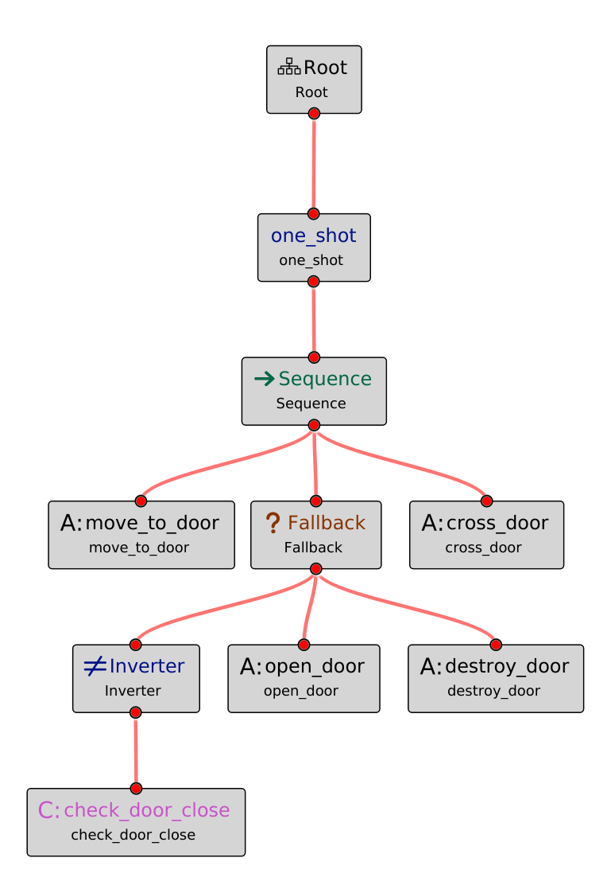
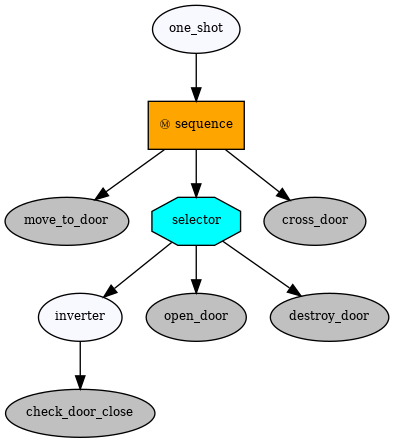

# Import Groot XML files into py_trees

[Groot](https://github.com/BehaviorTree/Groot) is a Graphical Editor, written in C++ and Qt, to create BehaviorTrees. It is only compatible with [BehaviorTree.CPP](https://github.com/BehaviorTree/BehaviorTree.CPP). This module is an attempt to use Groot to generate trees using [py_trees](https://github.com/splintered-reality/py_trees) instead of BehaviorTree.CPP.

The main purpose of this module is to load an XML file generated with Groot and transform it into a valif py_trees behavior tree. Execution of py_trees behavior trees is not connected to Groot for the moment.

<table>
    <tr>
        <td></td>
        <td></td>
    </tr>
    <tr>
        <td><p align="center">Groot Behavior Tree</p></td>
        <td><p align="center">py_trees Behavior Tree</p></td>
    </tr>
</table>

## Groot supported features 

BehaviorTree.CPP and py_trees use different control sequences, decorators and tree leaves. This section explains the mapping between one and the other in order to use Groot in py_trees.

### Control nodes to Composite nodes:

| Groot | py_trees |
|-------|----------|
| Sequence | Sequence with `memory=True` |
| ReactiveSequence | Sequence with `memory=False` |
| Fallback | Selector with `memory=True` |
| ReactiveFallback | Selector with `memory=False` |
| Parallel with `success_threshold=1` | Parallel with `policy=SuccessOnOne` |
| Parallel with `success_threshold <> 1` | Parallel with `policy=SuccessOnAll` |
| IfThenElse | not available |
| WhileDoElse | not available |
| SwitchX | not available |


### Decorators to Decorators

| Groot | py_trees |
|-------|----------|
| Timeout | Timeout |
| ForceFailure | SuccessIsFailure |
| ForceSuccess | FailureIsSuccess |
| Inverter | Inverter | 
| BlackboardCheckX | *EternalGuard?* | 
| KeepRunningUntilFailure | *Condition?* |
| Repeat | not available |
| RetryUntilSuccessful | not available |
| Delay | not available |
| User defined Decorator | Decorator in `decorators` |

Additional py_trees decorators, both core defined as `OneShot`, `StatusToBlackboard`, `FailureIsRunning`, `RunningIsSuccess`... or newly created by the user, must be added in the `decorators` diccionare and pass to the `load` function to be used.


### Actions and Conditions to Behaviors

| Groot | py_trees |
|-------|----------|
| AlwaysFailure | Failure |
| AlwaysSuccess | Success |
| SetBlackBoard | SetBlackboardVariable `output_key=value` |
| user defined Action | Behavior in `user_behaviors` |
| user defined Condition | Behavior in `user_behaviors` |


All manually defined Actions and Conditions in Groot have to be defined as py_trees `behaviors` and added into the `behaviors` list in function `load` to be used.

## Unsupported elements

The following elements are unsupported right now:

* Sub-trees
* Decorators with parameters 
* Connecting the execution of py_trees to Groot 

## Example

```python
import py_trees
from py_trees_meet_groot import groot_xml

# Define cusom Behaviors
behavior1 = py_trees.behaviours.Success(name="behavior1")
...
all_behaviors = [behavior1, behavior2, ...]

# Define any non-Groot decorator node
all_decorators = {}
one_shot = py_trees.decorators.OneShot
all_decorators["one_shot"] = one_shot
...

root = groot_xml.load("GROOT_XML_FILE_TO_LOAD.xml", behaviors=all_behaviors, decorators=all_decorators)
```

